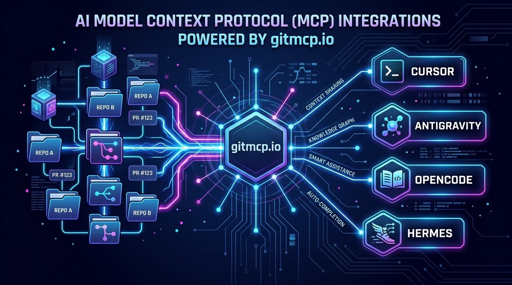
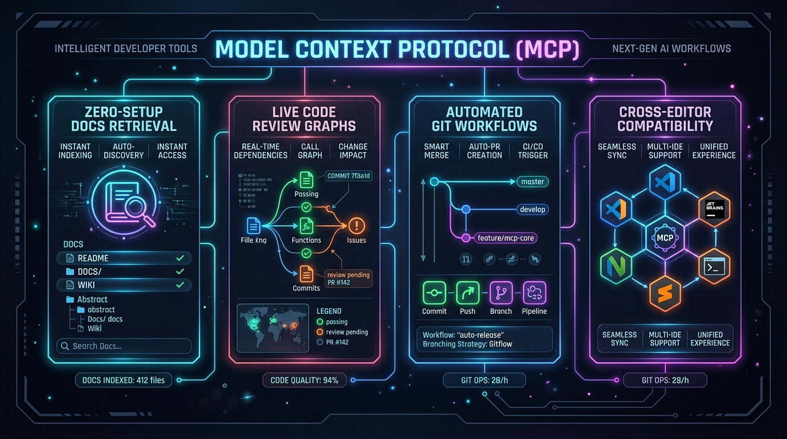

# Ultimate Model Context Protocol (MCP) Hub for Vibe Coding 🚀



Welcome to the ultimate curated collection of **Model Context Protocol (MCP)** servers & `gitmcp.io` endpoints, perfectly optimized for seamless **Vibe Coding** across modern AI code editors and agents!

---

## 🌟 Why Use GitMCP & MCP Servers for Vibe Coding?

> [!TIP]
> **Zero Configuration Context Retrieval**: `gitmcp.io` seamlessly turns any GitHub repository into an active MCP documentation endpoint without complex local indexing or API setup!



### ✨ Key Features & Benefits:
- **Instant Framework Documentation**: Access live documentation for key tools (DSPy, PocketBase, Ponytail, Reticle, UI/UX Pro) directly inside your AI prompt context.
- **Deep Code Review & Dependency Graphs**: Graph-powered call trees and structural change analysis before committing edits.
- **Automated GitHub & Mobile Workflows**: Built-in pull request creation, issue tracking, and automated mobile app screen driving.
- **Universal Multi-Agent Compatibility**: Fully compatible with **Cursor, Antigravity, Antigravity CLI, OpenCode, Hermes-Agent, Kimi-Code, CodeX**, and more.

---

## 📌 Curated Active MCP Servers List (`gitmcp.io` URLs)

Below is the structured list of high-power MCP servers:

| # | MCP Server Name | GitMCP URL / Source | Purpose & Function |
|---|---|---|---|
| 1 | **agentic-context-engine** | `https://gitmcp.io/kayba-ai/agentic-context-engine` | Agentic context engine documentation & tools |
| 2 | **archify** | `https://gitmcp.io/tt-a1i/archify` | Architecture diagramming & workflow visualization |
| 3 | **code-review-graph** | `https://gitmcp.io/tirth8205/code-review-graph` | Structural code review knowledge graph |
| 4 | **dspy-docs** | `https://gitmcp.io/stanfordnlp/dspy` | Stanford DSPy framework documentation |
| 5 | **github** | `https://gitmcp.io/modelcontextprotocol/servers` | Official GitHub API integration |
| 6 | **gitmcp-loop-engineering** | `https://gitmcp.io/cobusgreyling/loop-engineering` | Prompt loop engineering reference docs |
| 7 | **mobile-mcp** | `https://gitmcp.io/mobilenext/mobile-mcp` | Mobile app test automation & screen driving |
| 8 | **pocketbase** | `https://gitmcp.io/pocketbase/pocketbase` | PocketBase backend framework reference |
| 9 | **ponytail-docs** | `https://gitmcp.io/dietrichgebert/ponytail` | Minimalist code optimization guide |
| 10 | **reticle** | `https://gitmcp.io/reticlehq/reticle` | App state & runtime UI verification engine |
| 11 | **reticle-docs** | `https://gitmcp.io/fwdai/reticle` | Reticle testing documentation |
| 12 | **superpowers** | `https://gitmcp.io/obra/superpowers` | Agentic superpowers workflow guide |
| 13 | **ui-ux-pro-max-skill** | `https://gitmcp.io/nextlevelbuilder/ui-ux-pro-max-skill` | UI/UX design tokens & system compliance |

---

## 🛠️ Step-by-Step Integration Guide

### 1. 🌌 Antigravity & Antigravity CLI
Add to `~/.gemini/config/mcp_config.json`:
```json
{
  "mcpServers": {
    "archify": {
      "disabled": false,
      "serverUrl": "https://gitmcp.io/tt-a1i/archify"
    },
    "pocketbase": {
      "disabled": false,
      "serverUrl": "https://gitmcp.io/pocketbase/pocketbase"
    }
  }
}
```

---

### 2. ⚡ Cursor IDE
1. Open **Cursor Settings** (`Ctrl + ,` or `Cmd + ,`).
2. Navigate to **Features > MCP Servers**.
3. Click **+ Add New MCP Server**.
4. Fill details:
   - **Type**: `SSE` / `HTTP`
   - **Name**: `archify`
   - **URL**: `https://gitmcp.io/tt-a1i/archify`

---

### 3. 📖 CodeX / OpenCode & CLI
Add to `~/.config/opencode/mcp.json` or `.codex/mcp_config.json`:
```json
{
  "mcpServers": {
    "code-review-graph": {
      "serverUrl": "https://gitmcp.io/tirth8205/code-review-graph"
    },
    "dspy-docs": {
      "serverUrl": "https://gitmcp.io/stanfordnlp/dspy"
    }
  }
}
```

---

### 4. 🪽 Hermes-Agent & CLI
Run the following CLI commands:
```bash
hermes mcp add archify https://gitmcp.io/tt-a1i/archify
hermes mcp add superpowers https://gitmcp.io/obra/superpowers
```

---

### 5. 🌙 Kimi-Code
Configure in `.kimi/mcp.json`:
```json
{
  "mcp_servers": [
    {
      "name": "ui-ux-pro-max-skill",
      "url": "https://gitmcp.io/nextlevelbuilder/ui-ux-pro-max-skill"
    }
  ]
}
```

---

## 👤 Credits & Author

Curated and maintained with ❤️ by **Minaty001**.

> [!IMPORTANT]
> - 🐙 **GitHub Account**: [github.com/Minaty001](https://github.com/Minaty001)
> - 📺 **YouTube Channel**: [Minaty001 YouTube Channel](https://www.youtube.com/@Minaty001)

---

## 📄 License
MIT License © [Minaty001](https://github.com/Minaty001)
